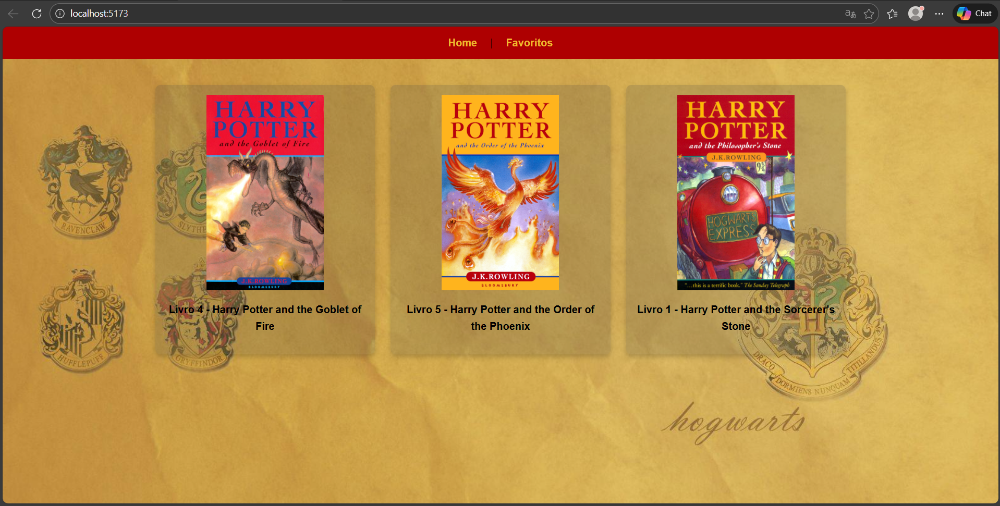
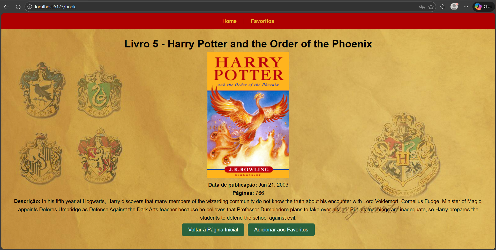
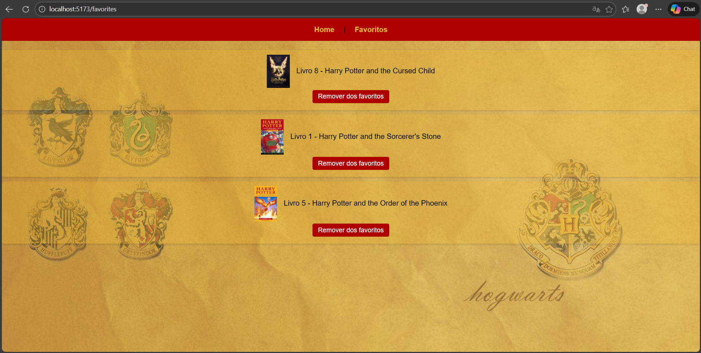

# 📚 react_vercel_app – Harry Potter Books

## 🧙‍♂️ Descrição do Projeto

Este projeto é uma aplicação web desenvolvida em **React** que consome uma API pública do universo **Harry Potter** para exibir livros de forma aleatória.  
A aplicação permite ao usuário visualizar livros, acessar detalhes completos de cada obra e gerenciar uma lista de **favoritos**, que é persistida no navegador utilizando `localStorage`.

O objetivo do projeto é aplicar conceitos fundamentais de **React**, como componentes funcionais, hooks personalizados, rotas com React Router, consumo de API e persistência de dados no front-end.

---

## 🚀 Funcionalidades

- Exibição de livros aleatórios do universo Harry Potter
- Navegação entre páginas (Home, Detalhes e Favoritos)
- Visualização detalhada de cada livro
- Adição e remoção de livros dos favoritos
- Persistência dos favoritos via `localStorage`
- Layout responsivo para dispositivos móveis

---

## 🔧 Tecnologias Utilizadas

- **React** (componentes funcionais e hooks)
- **Vite** (ferramenta de build e desenvolvimento)
- **Node.js** (ambiente de execução)
- **React Router DOM** (roteamento)
- **Fetch API** (consumo de API)
- **CSS3** (estilização e responsividade)
- **localStorage** (persistência de dados no navegador)

---

## 🖥️ Como Rodar o Projeto Localmente

### Pré-requisitos
- Node.js **versão 20 ou superior**
    - 
- NPM (instalado junto com o Node)

### Passo a passo

1. Clone o repositório
```bash
git clone https://github.com/devpatriota/react_vercel_app.git
```
2. Acesse a pasta do projeto:
```bash 
cd react_vercel_app
```

3. Instale as dependências:
```bash
npm install
```
4. Inicie o servidor de desenvolvimento:
```bash
npm run dev
```
5. Acesse no navegador:
http://localhost:5173

## 🖼️ Screenshots da Aplicação

### 🏠 Tela Inicial


### 📖 Tela de Detalhes


### ⭐ Tela de Favoritos


Este projeto foi desenvolvido como parte de uma atividade avaliativa da faculdade, com o objetivo de aplicar na prática os conhecimentos adquiridos durante o curso.

#### feito por devpatriota.